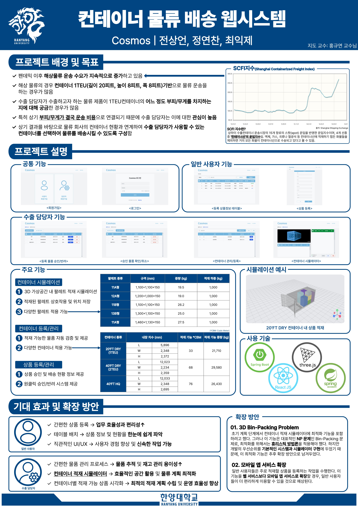

# Cosmos — 컨테이너 적재 시뮬레이션 웹 시스템

- 수출 물류 담당자가 컨테이너 적재를 3D 화면으로 미리 보고 결정하는 웹 애플리케이션
- 상품은 팔레트(화물을 얹어 지게차로 옮기는 규격 받침대) 위에 얹은 채로 컨테이너에 적재
- 한양대학교 ERICA 캠퍼스 2024년 1학기 캡스톤디자인 프로젝트 — 배포 데모 없이 로컬 실행만 지원



## 배경

- 적재 실수 감소와 컨테이너 활용률 향상이 목적
- 팬데믹 이후 해상 물류 수요 증가로 컨테이너 한 대의 적재 부피·무게 판단 빈도 상승
- 종이와 엑셀로 하던 판단을 화면 위 3D 공간으로 이전

## 핵심 기능

- 3D 적재 화면과 역할 기반 승인 흐름을 하나의 배포 산출물로 결합
- **3D 적재 시뮬레이션** — 컨테이너 내부 렌더링·담당자의 팔레트 수동 배치·서버의 한 층 자동 배치
- **역할 분리** — 일반 사용자의 상품 등록과 수출 담당자의 승인·컨테이너 배치로 권한 분리
- **규격 상수 내장** — 컨테이너 세 규격과 팔레트 다섯 종의 치수·중량을 코드 상수로 보유 (값은 「도메인 모델」 참고)
- **JWT 인증** — 로그인 시 JWT(서명이 붙은 인증 토큰) 두 종류 발급 · Access는 응답 헤더로·Refresh는 쿠키로 전달
- **단일 배포 산출물** — Gradle 빌드가 React를 Spring Boot 정적 리소스로 편입해 서버 하나로 프론트까지 기동

## 기술 스택

| 구성 | 스택 |
|---|---|
| 백엔드 | Spring Boot 3.2.3 · Java 17 · Spring Security · Spring Data JPA · JJWT 0.12.3 |
| 프론트엔드 | React 18 · TypeScript · React Router 6 · Tailwind CSS · daisyUI · styled-components · axios |
| 3D | Three.js — `@react-three/fiber` · `@react-three/drei` · `@react-three/rapier` |
| 데이터베이스 | MySQL |
| 빌드 | Gradle 8.5 (Wrapper 포함 — Gradle 설치 없이 `./gradlew`로 빌드) · Create React App |

## 실행

### 사전 준비

- MySQL에 데이터베이스와 계정 생성 — 테이블은 JPA가 `ddl-auto=update` 설정으로 엔티티를 읽어 자동 생성하므로 수동 작업 불필요

```sql
CREATE DATABASE db_cosmos DEFAULT CHARACTER SET utf8mb4;
CREATE USER 'user_cosmos'@'localhost' IDENTIFIED BY '<비밀번호>';
GRANT ALL PRIVILEGES ON db_cosmos.* TO 'user_cosmos'@'localhost';
```

- `src/main/resources/application.properties`의 `spring.datasource.password`와 `spring.jwt.secret`을 자기 환경 값으로 교체
- Node.js와 npm의 `PATH` 등록 필수 — `bootRun`이든 `build`든 `processResources` 태스크를 거쳐 Gradle이 React를 항상 먼저 빌드
- 태스크 실행 순서 — `copyReactBuildFiles` → `buildReact` → `installReact`

### 개발 모드

- 프론트엔드와 백엔드를 각각 다른 포트로 기동

```bash
./gradlew bootRun -x buildReact                    # 백엔드 → http://localhost:8080
cd src/main/frontend && npm install && npm start   # 프론트 → http://localhost:3000
```

- `package.json`의 `proxy` 설정이 프론트의 API 요청을 8080으로 전달
- `-x buildReact`로 React 빌드 태스크를 이번 실행에서 제외 — 3000번 개발 서버를 쓰므로 Gradle이 만드는 빌드 산출물은 미사용

### 통합 빌드

- React 빌드와 Spring Boot를 하나의 JAR로 묶어 기동

```bash
./gradlew build
java -jar build/libs/container-0.0.1-SNAPSHOT.jar   # http://localhost:8080
```

## 사용 순서

- 기동 후 아래 다섯 단계를 차례로 거치면 3D 적재 화면 진입

1. `/member/join`에서 일반 사용자 가입·로그인 후 `/user/uploadpd`에서 출고 상품 등록
2. 로그아웃 후 `/manager/join`에서 수출 담당자 가입
3. `/manager/apprWait`에서 앞서 등록한 상품 승인
4. `/manager/containerUpload`에서 컨테이너 규격과 출고 마감 시각 지정 후 등록
5. `/manager/containerList`에서 해당 컨테이너 진입 — 3D 적재 화면에서 승인 상품을 팔레트에 적재하고 위치 저장

## 디렉터리 구조

- Spring Boot 프로젝트 하나에 React 앱이 `src/main/frontend`로 들어간 단일 레포

```
Container_Simulator_Web
├── build.gradle                 # React 빌드를 Spring 정적 리소스로 복사하는 태스크 포함
├── docs/                        # 발표 포스터(PNG·PDF)
└── src
    ├── main
    │   ├── java/com/cosmos/container
    │   │   ├── config/          # SecurityConfig · CorsMvcConfig
    │   │   ├── constant/        # ContainerType · PalletType · Role · 승인/배송 상태 enum
    │   │   ├── controller/      # Container · Pallet · Product · Save · Reissue
    │   │   ├── dto/
    │   │   ├── entity/          # JPA 엔티티
    │   │   ├── jwt/             # LoginFilter · JWTFilter · JWTUtil · CustomLogoutFilter
    │   │   ├── repository/
    │   │   └── service/         # 도메인 서비스 + SchedulerService
    │   ├── resources/
    │   │   └── application.properties
    │   └── frontend/            # React 앱 (Create React App + TypeScript)
    │       ├── public/          # 컨테이너 3D 모델(glTF)과 표면 재질 텍스처(PBR)
    │       └── src
    │           ├── Router.tsx   # 라우팅 정본
    │           ├── components/  # Header · 네비게이터 · 공용 버튼
    │           ├── pages/
    │           │   ├── BoxPage.tsx  # 3D 편집 화면 진입점
    │           │   ├── manager/     # 컨테이너 등록·목록·승인·적재 화면
    │           │   ├── member/      # 상품 등록·조회 화면
    │           │   └── mythree/     # 3D 씬 — ShippingContainer(규격별) · MyBox · BoxList
    │           └── shared/axios/
    └── test/java/...
```

- `src/main/resources/static/`은 커밋 제외 — `copyReactBuildFiles` 태스크가 `src/main/frontend/build`를 복사해 만드는 빌드 산출물
- 프론트엔드 소스의 단일 출처는 `src/main/frontend`

## 도메인 모델

- 컨테이너 규격과 팔레트 규격은 코드 상수로 보유
- 상품은 승인 상태와 배송 상태를 분리 보유

**컨테이너 규격** — 이름과 최대 적재 중량은 `ContainerType`에 위치

| 규격 | 최대 적재 중량 |
|---|---|
| 20FT DRY | 21,700 kg |
| 40FT DRY | 26,740 kg |
| 40FT HQ | 26,580 kg |

**팔레트 규격** — 다섯 종(11A·12A·11B·13B·15A)의 가로·세로·자체 중량은 `PalletType`에 위치

**상태**

| 상태 | 값 | 바뀌는 때 |
|---|---|---|
| 승인 | 승인대기 · 승인 · 반려 | 담당자의 승인·반려·취소 요청 시 |
| 배송 | 없음 · 배송대기 · 배송중 · 배송완료 | 등록 시 없음 · 팔레트 적재 시 배송대기 · 출고 마감 경과 후 `SchedulerService`(마감을 주기적으로 확인하는 백엔드 스케줄러)가 1분 주기로 배송중 전환 |

- 배송완료는 enum에만 존재하고 대입 코드가 없어 도달 불가한 값

## API

- 권한 열의 이름 — 일반 사용자는 `ROLE_MEMBER`·수출 담당자는 `ROLE_MANAGER`

| 메서드 | 경로 | 권한 | 하는 일 |
|---|---|---|---|
| POST | `/members` · `/managers` | 누구나 | 일반 사용자·수출 담당자 회원가입 |
| GET | `/emails` · `/ids` | 누구나 | 이메일·아이디 중복 확인 |
| POST | `/login` | 누구나 | 로그인 후 Access·Refresh 토큰 발급 |
| POST | `/reissue` | 누구나 | Refresh 토큰으로 Access 토큰 재발급 (「한계」 참고) |
| POST | `/logout` | 쿠키 보유자 | Refresh 토큰 폐기 |
| POST · GET | `/products` | 일반 사용자 | 상품 등록·조회 |
| POST | `/products/delete` | 일반 사용자 | 상품 삭제 |
| GET | `/products/wait` · `/products/decide` | 수출 담당자 | 승인 대기·처리 완료 상품 조회 |
| PATCH | `/products/accept` · `/reject` · `/cancel` | 수출 담당자 | 상품 승인·반려·취소 |
| POST · GET | `/containers` | 로그인 사용자 | 컨테이너 등록·목록 |
| DELETE | `/containers?id={id}` | 로그인 사용자 | 컨테이너 삭제 |
| GET | `/containers/{container-id}` | 로그인 사용자 | 컨테이너 상세 조회 |
| GET | `/pallets/{container-id}` | 수출 담당자 | 컨테이너에 적재된 팔레트 조회 |
| GET | `/pallets/{container-id}/valid` | 수출 담당자 | 적재 가능 여부 검증 |
| POST | `/pallets` | 수출 담당자 | 팔레트 적재 |
| DELETE | `/pallets/{pallet-id}` | 수출 담당자 | 팔레트 해제 |
| PATCH | `/pallets` | 수출 담당자 | 3D 화면에서 옮긴 팔레트 좌표 저장 |
| PATCH | `/pallets/{container-id}/shipping` | 수출 담당자 | 컨테이너 안 팔레트를 좌우 2열 한 층으로 자동 배치 |

## 한계

- 학부 캡스톤 결과물이라 아래를 미해결로 남긴 채 종료 — 수정 없이 현황 그대로 기재
- **토큰 재발급** — `/reissue` 미동작 · `LoginFilter`의 발급 쿠키 이름은 `refreshToken`인데 `SecurityService.reissue`의 조회 이름은 `refresh`라 항상 `Refresh Token Null`로 400 응답 · 프론트에도 호출 코드 부재로 미검증 경로
- **컨테이너 경로의 권한** — `SecurityConfig`의 담당자 전용 경로 목록에 `containers`가 앞 슬래시 없이 등재 · 그 결과 `/containers`는 담당자 전용이 아니라 로그인 사용자 전체에 개방
- **Access 토큰 유효기간** — 로그인은 1시간·재발급은 10분으로 불일치 · 두 곳에 상수를 따로 적어 벌어진 차이로 추정
- **스케줄러의 반복 쓰기** — `SchedulerService`가 마감 경과 컨테이너를 매 주기 재수집해 이미 배송중인 상품에 같은 값을 1분마다 재기록 · 처리 완료 컨테이너를 거르는 조건 부재
- **설정값의 위치** — DB 비밀번호와 JWT 시크릿이 `application.properties`에 평문 상주 · 운영 배포 시 환경 변수나 외부 설정으로 분리 필요
- **쓰이지 않는 의존** — 백엔드의 Thymeleaf 두 의존은 `templates/` 부재로 미사용 · 프론트의 `json-server`·`faker`·`msw`는 초기 목 API(실제 서버 대신 가짜 응답을 주는 개발용 API) 실험 흔적으로 `src`에서 참조 없음
- **자동 배치의 범위** — `PalletService.shipPallets`는 팔레트를 좌우 번갈아 폭만큼 밀어 넣는 한 층 배치만 계산 · 부피 기준 최적화(3D Bin-Packing) 미구현
- **화면 지원 범위** — 데스크톱 브라우저만 확인 · 모바일 화면 미대응

## 팀

| 이름 | 학과 | 역할 |
|---|---|---|
| 전상언 | 컴퓨터학부 | 팀장 · 백엔드 개발 |
| 정연찬 | 컴퓨터학부 | 프론트엔드 개발 · UI/UX |
| 최익제 | ICT융합학부 | 시뮬레이션 구현 · 3D 모델링 |

- **과목** — 캡스톤디자인 (2024년 1학기)
- **지도교수** — 홍규연 교수님
- **기업 연계** — 모바일앱개발협동조합 (멘토: 최원서 대표)
- **소속** — 한양대학교 ERICA 캠퍼스

## 더 읽기

- [발표 포스터 (PDF)](./docs/CapStone_Cosmos.pdf) — 과제 배경과 시스템 구성을 한 장으로 정리한 자료
